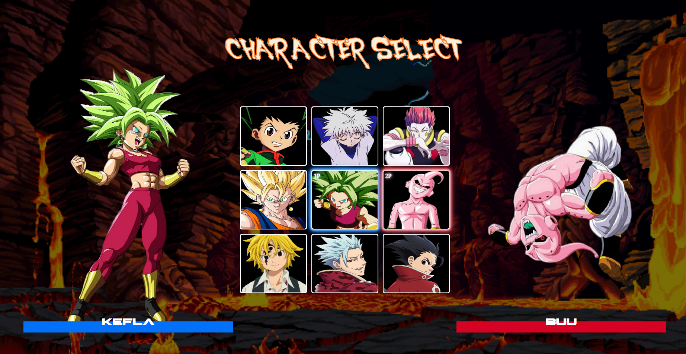

# Projeto Seletor de personagens

Projeto de que simula uma tela de seleção de personagens de um jogo de luta.

## Índice

- [Visão geral](#visão-geral)
  - [Descrição](#descrição)
  - [Screenshot](#screenshot)
  - [Links](#links)
- [Meu processo](#meu-processo)
  - [Tecnologias-utilizadas](#tecnologias-utilizadas)
  - [Desenvolvimento](#desenvolvimento)
- [Autor](#autor)
- [Agradecimentos](#agradecimentos)

## Visão geral

### Descrição
- Projeto simples desenvolvido em HTML, CSS e JavaScript. O objetivo da aplicação é permitir que o usuário selecione um personagem de uma lista pré-definida e exibir informações sobre ele, como o nome e a imagem do personagem. Além disso, a aplicação é responsiva e utiliza técnicas de design responsivo.
## Screenshot

### Desktop

### Mobile

### Links
- URL da página : [seletor de personagens](https://alexjr53.github.io/seletor-de-personagens/)
- Repositório do projeto no GitHub: [seletor de personagens](https://github.com/Alexjr53/seletor-de-personagens)

## Meu processo

### Tecnologias utilizadas

- HTML
- CSS
- JavaScript

### Desenvolvimento
Projeto criado para praticar conceitos de HTML, CSS e Javascript.

## Autor
Alexsandro rosa junior

- GitHub - [Alexjr53](https://github.com/Alexjr53)